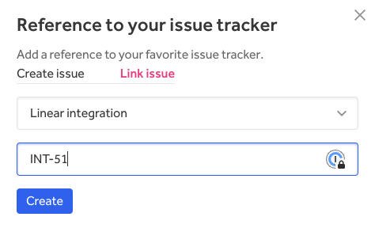

HackerOne offers a bidirectional Linear integration that syncs information between your HackerOne report and the Linear issue. This means that Linear users can sync specific workflows from Linear to HackerOne and vice versa, from HackerOne to Linear. This integration helps your development and security teams stay aligned and contributes to a better workflow to process security vulnerabilities as it minimizes the back and forth between Linear and HackerOne.

### Creating a Linear issue
You can create new Linear issues for reports you receive on HackerOne.

To create a new Linear issue from your HackerOne report:
1. Go to the HackerOne report in your inbox that you want to create a new Linear issue for.
2. Click on <i>References</i>.

3. Select the Linear integration that you want the report to escalate to in the dropdown.
4. Click **Create**.

5. Add comments or change the state of the report in Linear.

When you perform an action on the Linear report such as adding a comment or changing the status of the report, Hackbot will generate an internal comment on the HackerOne report to reflect the changes.

### Linking HackerOne Reports to Existing Linear Issues
You can link your HackerOne reports to existing Linear issues.

To link your reports:
1. Go to the HackerOne report in your inbox that you want to link to Linear.
2. Click **References** in the report sidebar.

3. Select <i>Link issue</i> and enter the Linear issue ID in the **Reference ID** field.
4. Click **Create**.

The HackerOne report will now be linked to the Linear issue, and all activities that are performed on the report will be synced to the corresponding issue.

There's also another way you can link your HackerOne reports to Linear. You can:
1. Go to the bottom of your HackerOne report.
2. Select **Change state > Triaged** in the action picker
3. Click **Add reference to issue tracker**.

4. Enter the Linear issue id in the **Reference ID** field.
5. Click **Create**.

### Syncing updates from HackerOne to Linear

With the Linear integration you can sync these report updates to Linear:
- Report Comments
- State changes
- Rewards
- Assignee changes
- Public disclosure

All updates on a report are synced as a comment to Linear. Additionally, all actions are configurable and can be toggled from the Linear integration settings page.

If you've configured your own [custom fields](/organizations/custom-fields.html), you can use them in the Linear integration. All custom fields automatically appear as available variables that you can use to set up the field mapping between HackerOne and Linear.

### Syncing updates from Linear to HackerOne

To make sure your security team stays up to date with the changes that happen in Linear, you can sync back activities from Linear to the HackerOne report. All updates from Linear will be reflected in HackerOne as an internal comment on the associated report.

We currently support these activities from Linear to HackerOne:
- Comments
- State changes
- Assignee changes
- Priority changes

You can choose which events you want to synchronize from Linear as each of the activities can be toggled individually.

### Automatically resolving a HackerOne report

You can set your integration to automatically close a HackerOne report as <i>Resolved</i> when a Linear issue closes. This enables the hacker to be notified right away when the Linear issue that's linked to the report is closed. In the **Select Linear to HackerOne events** section of the integration setup, select the Linear issue status that will trigger the closure of the HackerOne report.

### HackerOne Severity to Linear Priority Mapping

You can map HackerOne severity ratings to the Linear priority fields when configuring your integration. This enables the right priority to be set when escalating a report to Linear.

### Installing the Linear integration

See the [Linear Setup](linear-setup.html) page.
