You can integrate with Linear in order to sync information between your HackerOne report and your Linear issue.

To integrate with Linear:

1. Go to **Program Settings > Program > Integrations.**
2. Click the **Connect with Linear link.**

3. Click the **Set up new integration** button.
4. Enter **Name** and **Description** for your new integration and click **Next.**

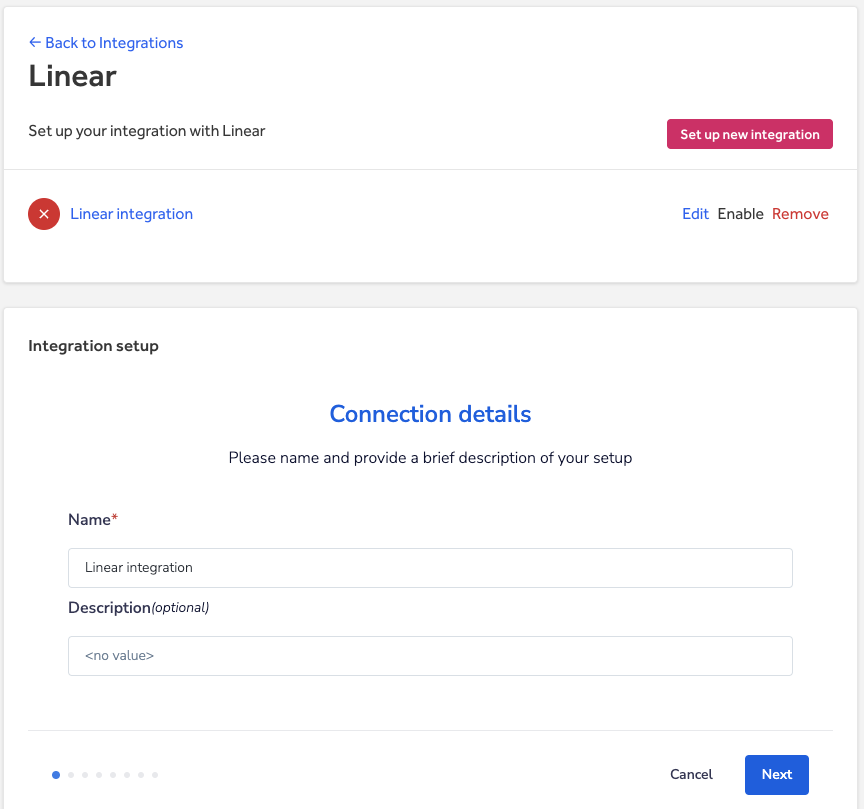

5. Navigate to the Linear API settings of Linear by going to **Settings > API** and add a new **Personal API key**.

6. Copy the generated key and save it somewhere save as it is shown only once.

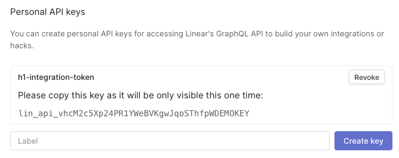

7. Navigate back to HackerOne and click **Add a new account** in the Linear authentication window.

8. Enter your API key from step 6 in the **Create a new authentication window** in the **Master token** field and click **Create.**

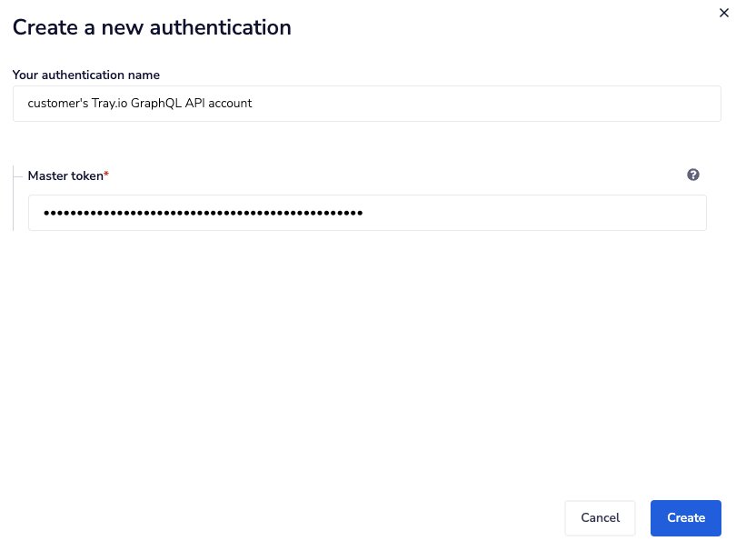

9. Configure which Linear Team and Project (optional)  you'd like to escalate HackerOne reports to in the **Linear Team and Project** window and click **Next**.

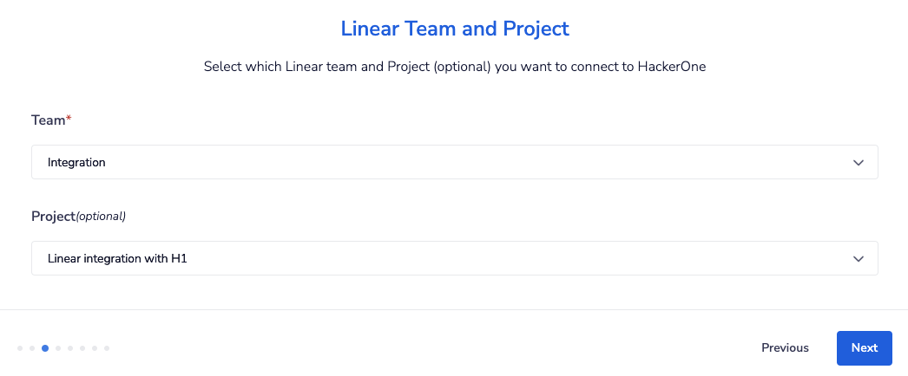

10. Select the HackerOne fields you want to map to the corresponding Linear fields. As alternative, enter any text using [integration variables](/organizations/integration-variables.html). Click **Next**.

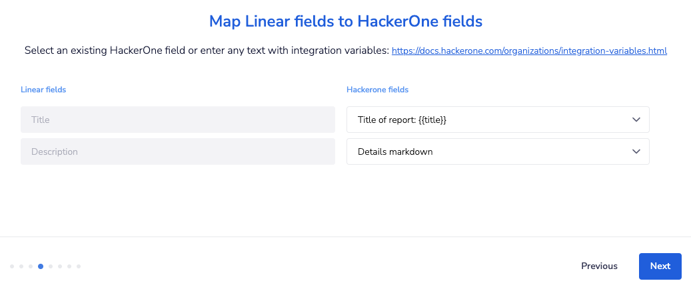

> **Note**: alternatively you can manually set the mapping to a single field or combination of fields from the [integration variables](/organizations/integration-variables.html). For example: `{{triage_summary}} \\ Link: {{report_link}} \\ Date: {{submission_date}} \\ Reporter: {{reporter_name}} \\ Weakness: {{weakness}}` Would create a combination of the triage summare, a link to the report the submission date, the reporter name and the weakness of their report and map that to a single field.

11. *(Optional)* Select Linear Priorities you want to map to the corresponding HackerOne Severities. This enables the right priority to be set when escalating a HackerOne report to Linear.

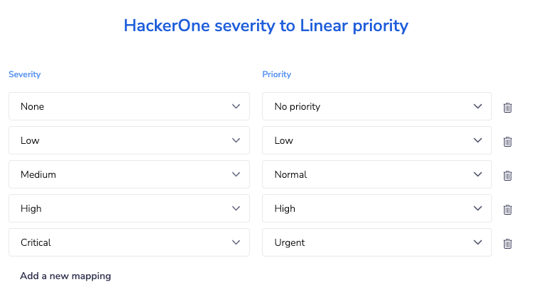

Click **Next**.

12. *(Optional)* Select which actions in HackerOne you'd like to post to Linear in the **Select HackerOne to Linear events** window. You can choose from:

Option | Detail
------ | -------
Comment added | When someone comments on a report, post an update on the associated Linear issue.
State changed | When someone changes the state of a report, post an update on the associated Linear issue.
Reward changed | When someone awards or suggests a bounty and/or bonus, post an update on the associated Linear issue.
Assignee changed | When someone assigns a user/group to a report, post an update on the associated Linear issue.
Disclosure | When disclosure is requested or a report becomes public, post an update on the associated Linear issue.

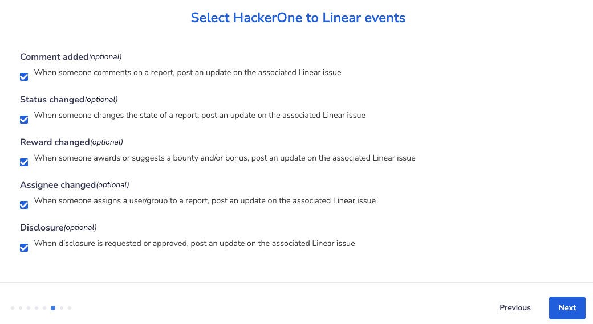

Click **Next**.

13. *(Optional)* Select which Linear actions you'd like to post onto HackerOne in the **Select Linear to HackerOne events** window. You can choose from:

Option | Detail
------ | -------
Status changed | Post an internal comment when an issue changes status.
Closed issue status | Resolve the report when an issue is closed with the selected status.
Comment added | Post an internal comment when someone comments on an issue.
Assignee changed | Post an internal comment when an issue changes assignee.
Priority changed | Post an internal comment when an issue changes priority.

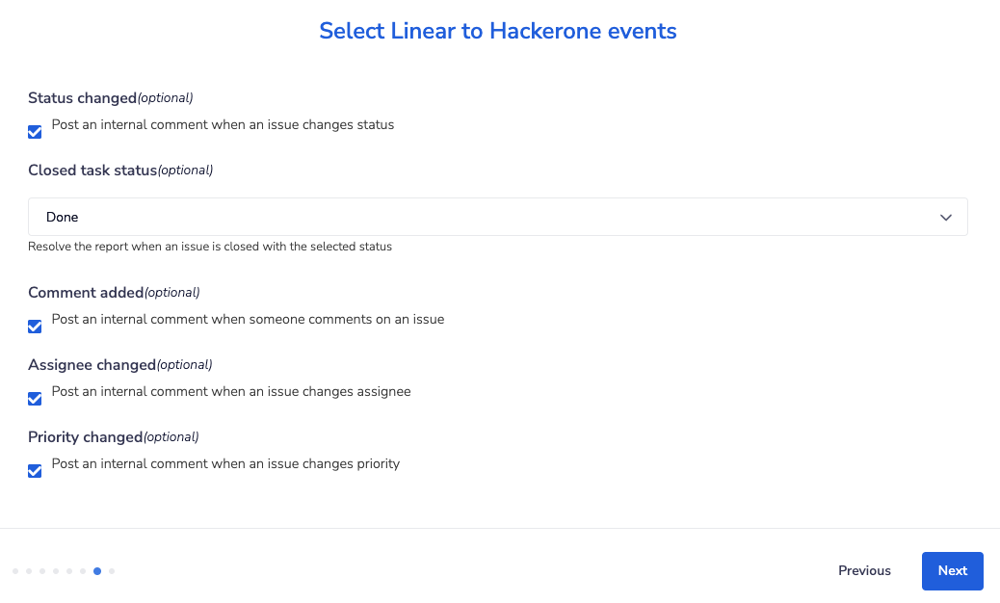

Click **Next**.

14. (Optional) If you have configured Linear actions to be synchronized to HackerOne in step 13 you will need to configure a webhook in Linear. Copy the **Webhook Public URL** that is shown in the **Workflow URLs** screen screen.

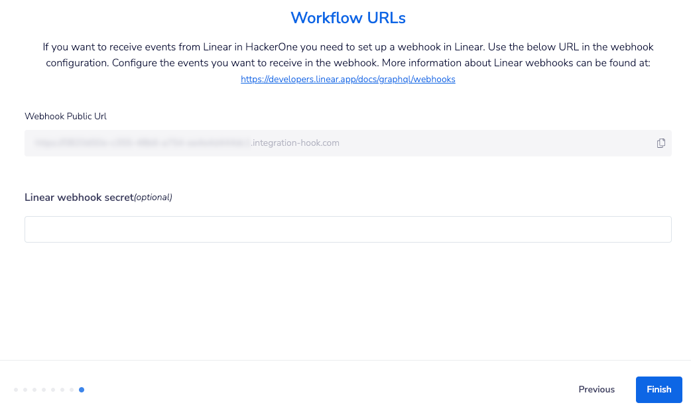

Navigate to the Linear API settings of Linear by going to **Settings > API** and create a new **Webhook**. Give the webhook a descriptive label and enter the Webhook Public Url into the **URL** field. Save the **Signing secret** for use later. Check the **Issues** and **Issue comments** events in the **Data change events** section. Finally set the **Teams** to **Custom**, and select only the team you have selected in step 9. Click **Create webhook**

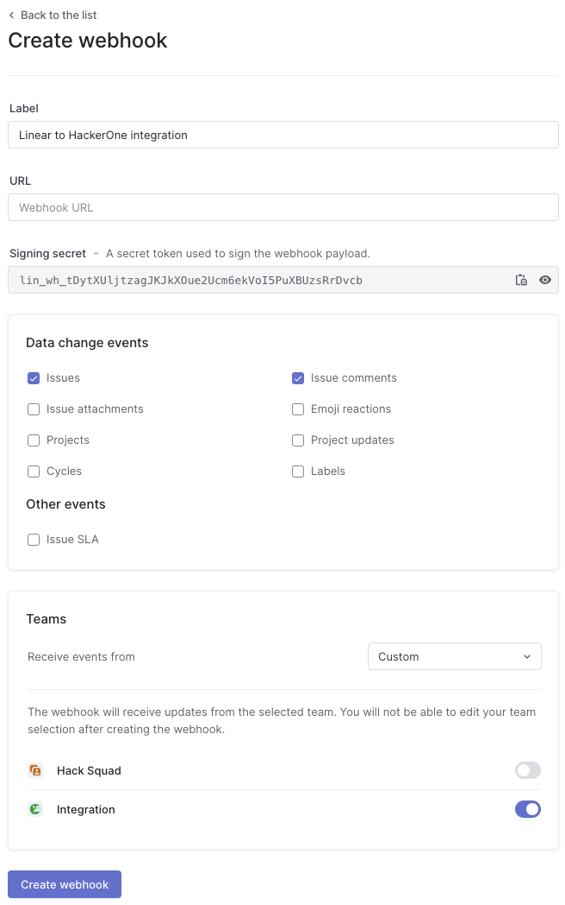

Copy the Signing secret into the **Linear webhook secret** field.

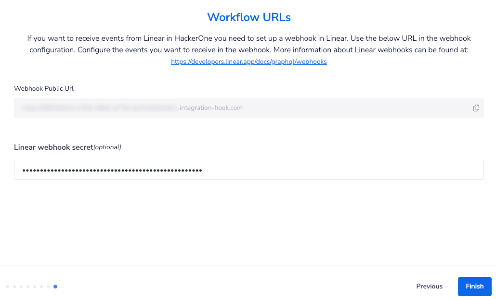

18. Click **Finish**. Once the screen disappears, click **Enable** to enable the integration.

You're all set! Now that you've finished setting up the Linear integration, you can [create Linear issues](/organizations/linear-integration.html#creating-a-Linear-issue) right from your HackerOne report.

### Multiple integrations

If you have multiple HackerOne programs, you can integrate them to the same Linear instance. Steps 5-6 can be omitted for each subsequent program you need to add an integration for.

*Note: You can omit steps 5-6 for your other programs because an API key has already been created when integrating with your first program, and only 1 key is needed to set up a Linear integration.*

### Multiple Linear instances per program
This feature is available for **Enterprise programs only**. If you want to integrate the same program to multiple Linear instances, you can follow all the steps above for each integration.
