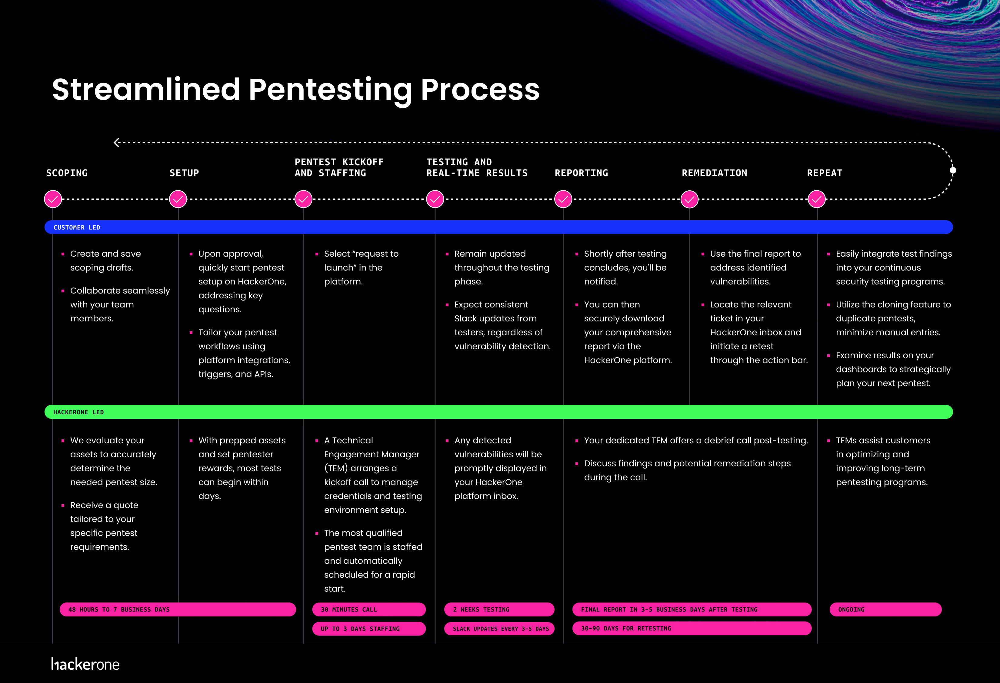
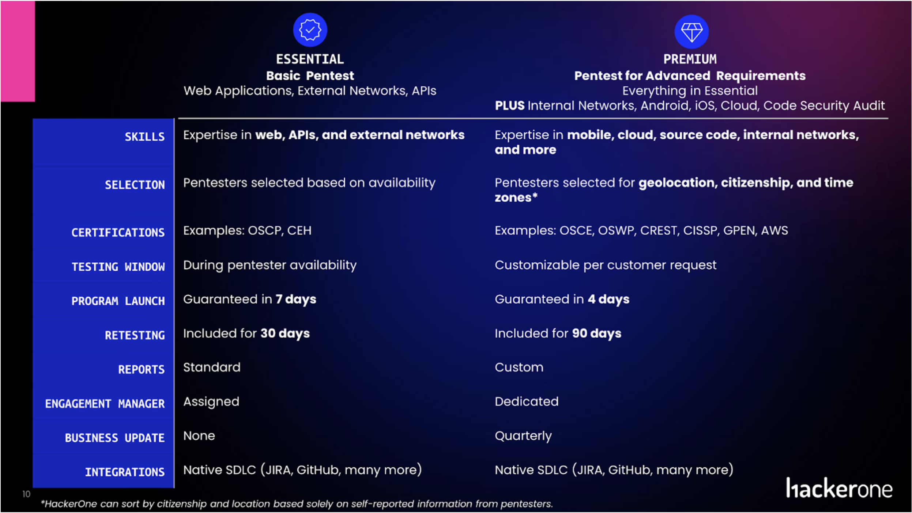

## Structure

By adhering to a structured testing approach, HackerOne aims to deliver consistent, high-quality pentest results tailored to the unique security requirements of our customers. The five key components of our pentest approach are explained below:

||                                                                                                                                                                                                                                                        |
|--|--------------------------------------------------------------------------------------------------------------------------------------------------------------------------------------------------------------------------------------------------------|
|**Team Composition**| <ul><li>Every pentest is led by one (1) Lead Pentester.</li><li>Up to four (4) additional pentesters may be included in the team, depending on the scope and requirements.</li></ul>                                                                   |
|**Pentest Tiers**| <ul><li>Pentests are categorized into two [distinct tiers](/hackers/background-checks.html): the Essential and the Premium.</li><li>Each tier carries its unique responsibilities, ensuring a tailored approach to different security needs.</li></ul> |
|**Duration and Effort**| <ul><li>All pentests, irrespective of their size or tier, are designed to run over a span of two (2) calendar weeks (14 days) unless specified otherwise.</li><li>Every pentester involved is expected to commit a total of forty (40) hours of effort during this period.</li></ul>                                                                                                                                                                                                                            |
|**Retesting Phase**| <ul><li>Following the main testing phase, a retesting window opens.</li><li>Pentesters assigned will be responsible for conducting retests during this period.</li><li>The duration of the retesting window is contingent upon the assessment tier chosen.</li></ul>                                                                                                                                                                                                                                                       |
|**Peer Review**| <ul><li>Collaboration is paramount to ensure consistency across each engagement.</li><li>At the end of each engagement, pentesters are required to review and provide feedback on their teammates' contributions, ensuring continuous improvement and cohesion within the team.</li></ul>                                                                                                                                                                                                                                                       |

## Streamlined Pentest Timeline

<table>
<thead>
<tr>
    <th>Scoping</th>
    <th>Setup</th>
    <th>Pentest Kickoff</th>
    <th>Testing and Real-time Results</th>
    <th>Reporting</th>
    <th>Remediation</th>
    <th>Repeat</th>
</tr>
</thead>
<tbody>
    <tr>
        <td>Create and save scoping drafts, collaborating seamlessly with team members.</td>
        <td>Once approved, initiate the pentest setup on the HackerOne platform, addressing key questions.</td>
        <td>Select 'request to launch'.</td>
        <td>Remain updated during the testing phase. Anticipate regular Slack updates from our testers, even when no vulnerabilities are detected during that period.</td>
        <td>Shortly after testing concludes, you'll be notified that your comprehensive report is available for secure download via the HackerOne platform.</td>
        <td>With the final report, you can address identified vulnerabilities. In your HackerOne inbox, find the relevant ticket and start a retest through the action bar.</td>
        <td>Effortlessly transition pentest findings to your continuous security testing programs. Use the cloning feature to simplify and duplicate pentests, reducing manual entries.</td>
    </tr>
    <tr>
        <td>HackerOne team evaluates your assets to determine the appropriate pentest size and provide a tailored quote.</td>
        <td>With prepped assets and set pentester rewards, most tests can begin within days.</td>
        <td>A pentest delivery specialist contacts you to arrange a kickoff call. In this discussion, tasks such as gathering credentials and setting up testing environments are addressed.</td>
        <td>Any detected vulnerabilities will be promptly relayed to your email and saved in your HackerOne inbox.</td>
        <td colspan="2">Your dedicated TEM then offers a debrief call to discuss findings and potential remediation steps.</td>
        <td>TEMs help customers optimize long-term pentesting programs, ensuring continuous improvements.</td>
    </tr>
    <tr>
        <td colspan="2">48 Hours to 7 Business Days</td>
        <td>30 Minutes</td>
        <td>2 Weeks Testing  Slack updates in every 3-5 days</td>
        <td colspan="2">Final report in 3-5 Business Days After Testing  30-90 Days for Retesting</td>
        <td>Ongoing</td>
    </tr>
</tbody>
</table>

## Scoping

The scoping of a pentest serves two functions: to identify the target of the test and to calculate the size of the test. The output of scoping is: 

 - The technical scope of the test, the assets and user roles to be tested
 - The size of test, how many people/hours and what type of skills are needed to complete the test to a high quality standard
 - A commercial quotation, how much this will cost 

The target of the test is the set of digital assets that will be assessed in the 2 week testing period by the pentesting team. The type of asset determines the checks that must be completed, the pentester skill requirements and the tier (essentials or premium). For example, when an Android mobile application is added to a HackerOne Pentest scope, the Android security checklist is added, pentesters are selected with skills and tools needed to audit android applications, and the test will be defined as a premium test to reflect the increased complexity of testing (over a simple web application).

The size of the test is the number of hours needed to achieve coverage of the test targets. The size is calculated from the type of asset and qualities such as the number of functions that an application performs and the number of user roles. 

## Size

There are five different units of measurement we use to define various pentest sizes that HackerOne offers. These sizes are calculated based on the testing hours needed per pentest, depending on the scope. 

All pentesters, including Leads, are expected to spend forty (40) hours of effort across all pentest sizes. Pentests are named based on the number of hours the assessment requires for the whole team and referred to as the following: 

<table>
<thead>
<tr>
    <th>Pentest Size</th>
    <th>Description</th>
    <th># of Lead Pentester</th>
    <th># of Supporting Pentester(s)</th>
</tr>
</thead>
<tbody>
    <tr>
        <td><b>P40</b></td>
        <td>Lead pentester performs all of the work by themselves.</td>
        <td>1</td>
        <td>-</td>
    </tr>
    <tr>
        <td><b>P80</b></td>
        <td>Lead pentester and a supporting pentester share the work.</td>
        <td>1</td>
        <td>1</td>
    </tr>
    <tr>
        <td><b>P120</b></td>
        <td>Lead pentester and a supporting pentester share the work.</td>
        <td>1</td>
        <td>2</td>
    </tr>
    <tr>
        <td><b>P160</b></td>
        <td>Lead pentester and a supporting pentester share the work.</td>
        <td>1</td>
        <td>3</td>
    </tr>
    <tr>
        <td><b>P200</b></td>
        <td>Lead pentester and a supporting pentester share the work.</td>
        <td>1</td>
        <td>4</td>
    </tr>
    <tr>
        <td><b>>P200</b></td>
        <td colspan="3">Contact your dedicated pentest team for custom sizing tailored to larger environments and multiple tests.</td>
    </tr>
</tbody>
</table>

> ℹ️ Of course, most organizations will be developing and maintaining multiple systems, and therefore, will need multiple tests. This is addressed with a consumption contract. A set number of hours are purchased, and these hours are deducted from the total during the contract period.

## Pentester Roles and Responsibilities

<table>
<thead>
<tr>
    <th>Pentest Lead</th>
    <th>Pentester</th>
</tr>
</thead>
<tbody>
    <tr>
        <td>
            <ul><li>Main point of contact with the Customer and HackerOne staff</li><li>Responds to all customer inquiries and questions within 1 business day</li><li>Provides updates frequently (minimum of 4 updates required)</li><li>Validates, performs QA and de-duplicates all submissions from the pentesters before they are submitted</li><li>Ensures all submissions are clear and optimized for the customer understanding</li><li>Leads the team, makes decision about scope and testing focus,  coordinates and delegates work where needed</li><li>Performs testing and retesting</li><li>Writes vulnerability reports and the summary report</li><li>Completes checklists and/or assigns these to testers making sure these are completed.</li></ul>
        </td>
        <td>
            <ul><li>Performs testing and retesting</li><li>Updates the lead about testing (minimum of 4 updates required)</li><li>Shares and validates vulnerabilities with the Lead and the team before submission</li><li>Writes Vulnerability reports</li><li>Provides all the information required by the lead (e.g. to answer customer questions)</li><li>Completes checklists according to what the lead assigns.</li></ul>
        </td>
    </tr>
    <tr>
        <td colspan="2" style="text-align: center;">
            <strong>40 hours of individual pentest work</strong>
        </td>
    </tr>
</tbody>
</table>

## Tiers

Regardless of the size and scope, all pentests are categorized on the platform into two distinct tiers: Essential and Premium. There are several fundamental differences between these two tiers, which are detailed below.

